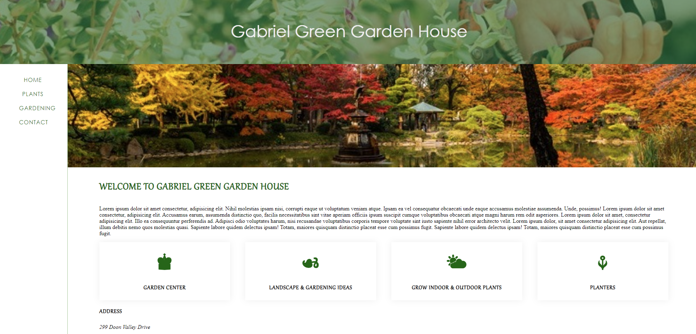

# 🌱 Gabriel Green Garden House

## 📌 Project Overview

**Gabriel Green Garden House** is an interactive gardening website that provides valuable information on **plants, gardening techniques, and expert consultation**. Designed with a **user-friendly interface**, this project features multiple sections covering different aspects of gardening, making it both informative and visually appealing.

Developed as a **college assignment**, this project showcases expertise in **responsive web design, structured content organization, and user engagement**.

---

## 🚀 Features

- 🌿 **Plants Page** – Explore different plant species with detailed descriptions and high-quality images.
- 🏡 **Gardening Tips** – Learn various gardening techniques and best practices.
- 📬 **Contact Page** – Users can easily reach out for professional gardening assistance.
- 📱 **Responsive Design** – Ensures seamless viewing on different screen sizes.
- 🎨 **Modern Styling** – Uses CSS for a clean, visually appealing layout and smooth user experience.

---

## 🛠 Technologies Used

- **HTML5** → Defines the structure and content of the site.
- **CSS3** → Enhances the visual presentation and layout.
- **Responsive Web Design** → Uses **Flexbox** and **Grid** techniques for adaptability across devices.

---

## 🎯 Project Purpose

This project was developed as part of a **college assignment**, allowing me to:

- ✅ Implement **HTML & CSS** for structured and engaging content.
- ✅ Design a fully **responsive layout** for seamless accessibility.
- ✅ Develop a **user-friendly navigation system** to enhance the browsing experience.

---

## 📂 Project Structure

```
📁 gabriel_green_garden_house
 ├── 📁 css/               # Stylesheets
 │   ├── site.css         # Main styling file
 ├── 📁 imgs/              # Image assets
 ├── 📁 pages/             # Webpages for different sections
 │   ├── index.html       # Homepage
 │   ├── plants.html      # Plant descriptions and images
 │   ├── gardening.html   # Gardening tips and best practices
 │   ├── contact.html     # Contact form and team details
```

---

## 📌 Prerequisites

To run the project, ensure you have:

- A **modern web browser** (Chrome, Firefox, Edge, etc.).

---

## 🏃‍♂️ How to Run the Project

1️⃣ **Open** `index.html` in a web browser.  
2️⃣ **Navigate** through the site using the intuitive menu.  

---

## 🎭 Screenshots  

| Gabriel Green Garden House |  
|--------------|  
|  |  

---

## 📜 License

This project was developed for **educational purposes** as part of a college assignment.

---

## 💼 Author

👤 **Juan Jacobo Florez Monroy**  
🌐 **Portfolio**: [jjacobo95.com](https://jjacobo95.com)  
🐙 **GitHub**: [github.com/jjacoboflorez95](https://github.com/jjacoboflorez95)